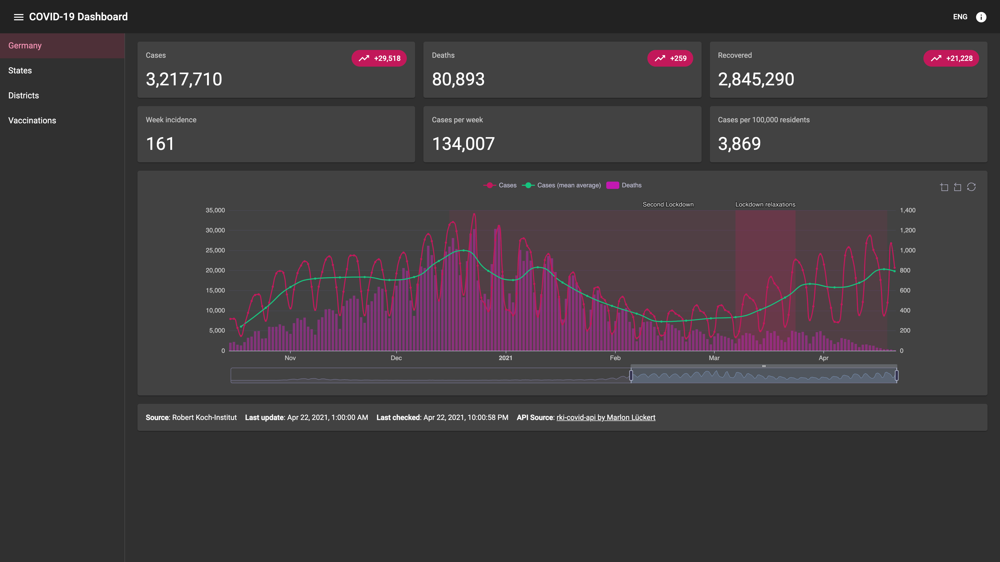

# RKI COVID-19 Dashboard Germany

This is a simple dashboard for COVID-19 data in Germany. It uses the [rki-covid-api](https://github.com/marlon360/rki-covid-api) by [marlon360](https://github.com/marlon360).

